# KickStarter
---
## Content
Kickstarter campaigns make ideas into reality. It’s where creators share new visions for creative work with the communities that will come together to fund them. To help bring creative projects to life.

## Context
Many creative ideas get the funded to fullfill their dream, while amount of them are not. This notebook are aiming to 
find the way to help campaign own gain more chance for success in fundind. By analyse a given kickstarter dataset
find correlation between features, gain more data insight and conduct data visualization.


```python
import pandas as pd
import matplotlib.pyplot as plt
import seaborn as sns
import numpy as np

%config InlineBackend.figure_format = 'retina'
```

### Import Data


```python
data = pd.read_csv('DSI_kickstarterscrape_dataset.csv')
data.head()
```


<div>
<style scoped>
    .dataframe tbody tr th:only-of-type {
        vertical-align: middle;
    }

    .dataframe tbody tr th {
        vertical-align: top;
    }

    .dataframe thead th {
        text-align: right;
    }
</style>
<table border="1" class="dataframe">
  <thead>
    <tr style="text-align: right;">
      <th></th>
      <th>project id</th>
      <th>name</th>
      <th>url</th>
      <th>category</th>
      <th>subcategory</th>
      <th>location</th>
      <th>status</th>
      <th>goal</th>
      <th>pledged</th>
      <th>funded percentage</th>
      <th>backers</th>
      <th>funded date</th>
      <th>levels</th>
      <th>reward levels</th>
      <th>updates</th>
      <th>comments</th>
      <th>duration</th>
    </tr>
  </thead>
  <tbody>
    <tr>
      <th>0</th>
      <td>39409</td>
      <td>WHILE THE TREES SLEEP</td>
      <td>http://www.kickstarter.com/projects/emiliesaba...</td>
      <td>Film &amp; Video</td>
      <td>Short Film</td>
      <td>Columbia, MO</td>
      <td>successful</td>
      <td>10500.0</td>
      <td>11545.0</td>
      <td>1.099524</td>
      <td>66</td>
      <td>Fri, 19 Aug 2011 19:28:17 -0000</td>
      <td>7</td>
      <td>$25,$50,$100,$250,$500,$1,000,$2,500</td>
      <td>10</td>
      <td>2</td>
      <td>30.00</td>
    </tr>
    <tr>
      <th>1</th>
      <td>126581</td>
      <td>Educational Online Trading Card Game</td>
      <td>http://www.kickstarter.com/projects/972789543/...</td>
      <td>Games</td>
      <td>Board &amp; Card Games</td>
      <td>Maplewood, NJ</td>
      <td>failed</td>
      <td>4000.0</td>
      <td>20.0</td>
      <td>0.005000</td>
      <td>2</td>
      <td>Mon, 02 Aug 2010 03:59:00 -0000</td>
      <td>5</td>
      <td>$1,$5,$10,$25,$50</td>
      <td>6</td>
      <td>0</td>
      <td>47.18</td>
    </tr>
    <tr>
      <th>2</th>
      <td>138119</td>
      <td>STRUM</td>
      <td>http://www.kickstarter.com/projects/185476022/...</td>
      <td>Film &amp; Video</td>
      <td>Animation</td>
      <td>Los Angeles, CA</td>
      <td>live</td>
      <td>20000.0</td>
      <td>56.0</td>
      <td>0.002800</td>
      <td>3</td>
      <td>Fri, 08 Jun 2012 00:00:31 -0000</td>
      <td>10</td>
      <td>$1,$10,$25,$40,$50,$100,$250,$1,000,$1,337,$9,001</td>
      <td>1</td>
      <td>0</td>
      <td>28.00</td>
    </tr>
    <tr>
      <th>3</th>
      <td>237090</td>
      <td>GETTING OVER - One son's search to finally kno...</td>
      <td>http://www.kickstarter.com/projects/charnick/g...</td>
      <td>Film &amp; Video</td>
      <td>Documentary</td>
      <td>Los Angeles, CA</td>
      <td>successful</td>
      <td>6000.0</td>
      <td>6535.0</td>
      <td>1.089167</td>
      <td>100</td>
      <td>Sun, 08 Apr 2012 02:14:00 -0000</td>
      <td>13</td>
      <td>$1,$10,$25,$30,$50,$75,$85,$100,$110,$250,$500...</td>
      <td>4</td>
      <td>0</td>
      <td>32.22</td>
    </tr>
    <tr>
      <th>4</th>
      <td>246101</td>
      <td>The Launch of FlyeGrlRoyalty &amp;quot;The New Nam...</td>
      <td>http://www.kickstarter.com/projects/flyegrlroy...</td>
      <td>Fashion</td>
      <td>Fashion</td>
      <td>Novi, MI</td>
      <td>failed</td>
      <td>3500.0</td>
      <td>0.0</td>
      <td>0.000000</td>
      <td>0</td>
      <td>Wed, 01 Jun 2011 15:25:39 -0000</td>
      <td>6</td>
      <td>$10,$25,$50,$100,$150,$250</td>
      <td>2</td>
      <td>0</td>
      <td>30.00</td>
    </tr>
  </tbody>
</table>
</div>


### Clean and Transform Data

Unuse columns: **project id, name, url** have no correlation with successful rate, so I drop all unuse columns


```python
usecols=['category', 'subcategory', 'location',
       'status', 'goal', 'pledged', 'backers',
       'funded date', 'levels', 'updates', 'comments',
       'duration']

data = data[usecols]
data.head()
```


<div>
<style scoped>
    .dataframe tbody tr th:only-of-type {
        vertical-align: middle;
    }

    .dataframe tbody tr th {
        vertical-align: top;
    }

    .dataframe thead th {
        text-align: right;
    }
</style>
<table border="1" class="dataframe">
  <thead>
    <tr style="text-align: right;">
      <th></th>
      <th>category</th>
      <th>subcategory</th>
      <th>location</th>
      <th>status</th>
      <th>goal</th>
      <th>pledged</th>
      <th>backers</th>
      <th>funded date</th>
      <th>levels</th>
      <th>updates</th>
      <th>comments</th>
      <th>duration</th>
    </tr>
  </thead>
  <tbody>
    <tr>
      <th>0</th>
      <td>Film &amp; Video</td>
      <td>Short Film</td>
      <td>Columbia, MO</td>
      <td>successful</td>
      <td>10500.0</td>
      <td>11545.0</td>
      <td>66</td>
      <td>Fri, 19 Aug 2011 19:28:17 -0000</td>
      <td>7</td>
      <td>10</td>
      <td>2</td>
      <td>30.00</td>
    </tr>
    <tr>
      <th>1</th>
      <td>Games</td>
      <td>Board &amp; Card Games</td>
      <td>Maplewood, NJ</td>
      <td>failed</td>
      <td>4000.0</td>
      <td>20.0</td>
      <td>2</td>
      <td>Mon, 02 Aug 2010 03:59:00 -0000</td>
      <td>5</td>
      <td>6</td>
      <td>0</td>
      <td>47.18</td>
    </tr>
    <tr>
      <th>2</th>
      <td>Film &amp; Video</td>
      <td>Animation</td>
      <td>Los Angeles, CA</td>
      <td>live</td>
      <td>20000.0</td>
      <td>56.0</td>
      <td>3</td>
      <td>Fri, 08 Jun 2012 00:00:31 -0000</td>
      <td>10</td>
      <td>1</td>
      <td>0</td>
      <td>28.00</td>
    </tr>
    <tr>
      <th>3</th>
      <td>Film &amp; Video</td>
      <td>Documentary</td>
      <td>Los Angeles, CA</td>
      <td>successful</td>
      <td>6000.0</td>
      <td>6535.0</td>
      <td>100</td>
      <td>Sun, 08 Apr 2012 02:14:00 -0000</td>
      <td>13</td>
      <td>4</td>
      <td>0</td>
      <td>32.22</td>
    </tr>
    <tr>
      <th>4</th>
      <td>Fashion</td>
      <td>Fashion</td>
      <td>Novi, MI</td>
      <td>failed</td>
      <td>3500.0</td>
      <td>0.0</td>
      <td>0</td>
      <td>Wed, 01 Jun 2011 15:25:39 -0000</td>
      <td>6</td>
      <td>2</td>
      <td>0</td>
      <td>30.00</td>
    </tr>
  </tbody>
</table>
</div>


```python
data.info()
```

    <class 'pandas.core.frame.DataFrame'>
    RangeIndex: 45957 entries, 0 to 45956
    Data columns (total 12 columns):
     #   Column       Non-Null Count  Dtype  
    ---  ------       --------------  -----  
     0   category     45957 non-null  object 
     1   subcategory  45957 non-null  object 
     2   location     44635 non-null  object 
     3   status       45957 non-null  object 
     4   goal         45957 non-null  float64
     5   pledged      45945 non-null  float64
     6   backers      45957 non-null  int64  
     7   funded date  45957 non-null  object 
     8   levels       45957 non-null  int64  
     9   updates      45957 non-null  int64  
     10  comments     45957 non-null  int64  
     11  duration     45957 non-null  float64
    dtypes: float64(3), int64(4), object(5)
    memory usage: 4.2+ MB
    

#### Remove **missing data**


```python
data.isnull().sum()
```


    category          0
    subcategory       0
    location       1322
    status            0
    goal              0
    pledged          12
    backers           0
    funded date       0
    levels            0
    updates           0
    comments          0
    duration          0
    dtype: int64


```python
data = data.dropna(axis=0, how='any')
```


```python
data.isnull().sum()
```


    category       0
    subcategory    0
    location       0
    status         0
    goal           0
    pledged        0
    backers        0
    funded date    0
    levels         0
    updates        0
    comments       0
    duration       0
    dtype: int64


### Remove outlier


```python
data.describe()
```


<div>
<style scoped>
    .dataframe tbody tr th:only-of-type {
        vertical-align: middle;
    }

    .dataframe tbody tr th {
        vertical-align: top;
    }

    .dataframe thead th {
        text-align: right;
    }
</style>
<table border="1" class="dataframe">
  <thead>
    <tr style="text-align: right;">
      <th></th>
      <th>goal</th>
      <th>pledged</th>
      <th>backers</th>
      <th>levels</th>
      <th>updates</th>
      <th>comments</th>
      <th>duration</th>
    </tr>
  </thead>
  <tbody>
    <tr>
      <th>count</th>
      <td>4.462300e+04</td>
      <td>4.462300e+04</td>
      <td>44623.000000</td>
      <td>44623.000000</td>
      <td>44623.000000</td>
      <td>44623.000000</td>
      <td>44623.000000</td>
    </tr>
    <tr>
      <th>mean</th>
      <td>1.208708e+04</td>
      <td>5.048922e+03</td>
      <td>70.436210</td>
      <td>8.036842</td>
      <td>4.065280</td>
      <td>8.292428</td>
      <td>39.637268</td>
    </tr>
    <tr>
      <th>std</th>
      <td>1.915289e+05</td>
      <td>5.756924e+04</td>
      <td>697.580874</td>
      <td>4.248604</td>
      <td>6.400805</td>
      <td>173.424523</td>
      <td>17.102064</td>
    </tr>
    <tr>
      <th>min</th>
      <td>1.000000e-02</td>
      <td>0.000000e+00</td>
      <td>0.000000</td>
      <td>0.000000</td>
      <td>0.000000</td>
      <td>0.000000</td>
      <td>1.000000</td>
    </tr>
    <tr>
      <th>25%</th>
      <td>1.800000e+03</td>
      <td>2.000000e+02</td>
      <td>5.000000</td>
      <td>5.000000</td>
      <td>0.000000</td>
      <td>0.000000</td>
      <td>30.000000</td>
    </tr>
    <tr>
      <th>50%</th>
      <td>4.000000e+03</td>
      <td>1.323000e+03</td>
      <td>23.000000</td>
      <td>7.000000</td>
      <td>2.000000</td>
      <td>0.000000</td>
      <td>31.610000</td>
    </tr>
    <tr>
      <th>75%</th>
      <td>1.000000e+04</td>
      <td>4.200000e+03</td>
      <td>60.000000</td>
      <td>10.000000</td>
      <td>6.000000</td>
      <td>3.000000</td>
      <td>47.040000</td>
    </tr>
    <tr>
      <th>max</th>
      <td>2.147484e+07</td>
      <td>1.026684e+07</td>
      <td>87142.000000</td>
      <td>80.000000</td>
      <td>149.000000</td>
      <td>19311.000000</td>
      <td>91.960000</td>
    </tr>
  </tbody>
</table>
</div>


Since our data has **outlier**, this have to be filter out before analyse.


```python
def filter_outliers(df, feature):
    bottom = df[feature].quantile(.01)
    top = df[feature].quantile(.99)
    return (df[feature] >= bottom) & (df[feature] <= top)

data_filter = data[filter_outliers(data,'goal')]
data_filter = data_filter[filter_outliers(data_filter,'pledged')]
data_filter = data_filter[filter_outliers(data_filter,'backers')]
data_filter = data_filter[filter_outliers(data_filter,'levels')]
data_filter = data_filter[filter_outliers(data_filter,'updates')]
data_filter = data_filter[filter_outliers(data_filter,'comments')]
data_filter = data_filter[filter_outliers(data_filter,'duration')]
data = data_filter
```


```python
data.describe()
```


<div>
<style scoped>
    .dataframe tbody tr th:only-of-type {
        vertical-align: middle;
    }

    .dataframe tbody tr th {
        vertical-align: top;
    }

    .dataframe thead th {
        text-align: right;
    }
</style>
<table border="1" class="dataframe">
  <thead>
    <tr style="text-align: right;">
      <th></th>
      <th>goal</th>
      <th>pledged</th>
      <th>backers</th>
      <th>levels</th>
      <th>updates</th>
      <th>comments</th>
      <th>duration</th>
    </tr>
  </thead>
  <tbody>
    <tr>
      <th>count</th>
      <td>40923.000000</td>
      <td>40923.000000</td>
      <td>40923.000000</td>
      <td>40923.000000</td>
      <td>40923.000000</td>
      <td>40923.000000</td>
      <td>40923.000000</td>
    </tr>
    <tr>
      <th>mean</th>
      <td>7603.122239</td>
      <td>2969.980329</td>
      <td>39.859443</td>
      <td>7.754539</td>
      <td>3.395743</td>
      <td>2.340322</td>
      <td>39.421837</td>
    </tr>
    <tr>
      <th>std</th>
      <td>11753.309466</td>
      <td>4596.674317</td>
      <td>52.341557</td>
      <td>3.461573</td>
      <td>4.597987</td>
      <td>4.486694</td>
      <td>16.222611</td>
    </tr>
    <tr>
      <th>min</th>
      <td>200.000000</td>
      <td>0.000000</td>
      <td>0.000000</td>
      <td>1.000000</td>
      <td>0.000000</td>
      <td>0.000000</td>
      <td>10.000000</td>
    </tr>
    <tr>
      <th>25%</th>
      <td>1800.000000</td>
      <td>186.000000</td>
      <td>5.000000</td>
      <td>5.000000</td>
      <td>0.000000</td>
      <td>0.000000</td>
      <td>30.000000</td>
    </tr>
    <tr>
      <th>50%</th>
      <td>4000.000000</td>
      <td>1230.000000</td>
      <td>22.000000</td>
      <td>7.000000</td>
      <td>2.000000</td>
      <td>0.000000</td>
      <td>31.390000</td>
    </tr>
    <tr>
      <th>75%</th>
      <td>8299.500000</td>
      <td>3714.000000</td>
      <td>54.000000</td>
      <td>10.000000</td>
      <td>5.000000</td>
      <td>3.000000</td>
      <td>46.225000</td>
    </tr>
    <tr>
      <th>max</th>
      <td>100000.000000</td>
      <td>44856.000000</td>
      <td>407.000000</td>
      <td>21.000000</td>
      <td>27.000000</td>
      <td>33.000000</td>
      <td>90.040000</td>
    </tr>
  </tbody>
</table>
</div>


### Transform data


```python
data.info()
```

    <class 'pandas.core.frame.DataFrame'>
    Int64Index: 40923 entries, 0 to 45956
    Data columns (total 12 columns):
     #   Column       Non-Null Count  Dtype  
    ---  ------       --------------  -----  
     0   category     40923 non-null  object 
     1   subcategory  40923 non-null  object 
     2   location     40923 non-null  object 
     3   status       40923 non-null  object 
     4   goal         40923 non-null  float64
     5   pledged      40923 non-null  float64
     6   backers      40923 non-null  int64  
     7   funded date  40923 non-null  object 
     8   levels       40923 non-null  int64  
     9   updates      40923 non-null  int64  
     10  comments     40923 non-null  int64  
     11  duration     40923 non-null  float64
    dtypes: float64(3), int64(4), object(5)
    memory usage: 4.1+ MB
    


```python
data.describe(include='all')
```


<div>
<style scoped>
    .dataframe tbody tr th:only-of-type {
        vertical-align: middle;
    }

    .dataframe tbody tr th {
        vertical-align: top;
    }

    .dataframe thead th {
        text-align: right;
    }
</style>
<table border="1" class="dataframe">
  <thead>
    <tr style="text-align: right;">
      <th></th>
      <th>category</th>
      <th>subcategory</th>
      <th>location</th>
      <th>status</th>
      <th>goal</th>
      <th>pledged</th>
      <th>backers</th>
      <th>funded date</th>
      <th>levels</th>
      <th>updates</th>
      <th>comments</th>
      <th>duration</th>
    </tr>
  </thead>
  <tbody>
    <tr>
      <th>count</th>
      <td>40923</td>
      <td>40923</td>
      <td>40923</td>
      <td>40923</td>
      <td>40923.000000</td>
      <td>40923.000000</td>
      <td>40923.000000</td>
      <td>40923</td>
      <td>40923.000000</td>
      <td>40923.000000</td>
      <td>40923.000000</td>
      <td>40923.000000</td>
    </tr>
    <tr>
      <th>unique</th>
      <td>14</td>
      <td>51</td>
      <td>4672</td>
      <td>5</td>
      <td>NaN</td>
      <td>NaN</td>
      <td>NaN</td>
      <td>36961</td>
      <td>NaN</td>
      <td>NaN</td>
      <td>NaN</td>
      <td>NaN</td>
    </tr>
    <tr>
      <th>top</th>
      <td>Film &amp;amp; Video</td>
      <td>Short Film</td>
      <td>Los Angeles, CA</td>
      <td>successful</td>
      <td>NaN</td>
      <td>NaN</td>
      <td>NaN</td>
      <td>Sun, 01 Jan 2012 04:59:00 -0000</td>
      <td>NaN</td>
      <td>NaN</td>
      <td>NaN</td>
      <td>NaN</td>
    </tr>
    <tr>
      <th>freq</th>
      <td>11585</td>
      <td>3652</td>
      <td>3552</td>
      <td>19843</td>
      <td>NaN</td>
      <td>NaN</td>
      <td>NaN</td>
      <td>42</td>
      <td>NaN</td>
      <td>NaN</td>
      <td>NaN</td>
      <td>NaN</td>
    </tr>
    <tr>
      <th>mean</th>
      <td>NaN</td>
      <td>NaN</td>
      <td>NaN</td>
      <td>NaN</td>
      <td>7603.122239</td>
      <td>2969.980329</td>
      <td>39.859443</td>
      <td>NaN</td>
      <td>7.754539</td>
      <td>3.395743</td>
      <td>2.340322</td>
      <td>39.421837</td>
    </tr>
    <tr>
      <th>std</th>
      <td>NaN</td>
      <td>NaN</td>
      <td>NaN</td>
      <td>NaN</td>
      <td>11753.309466</td>
      <td>4596.674317</td>
      <td>52.341557</td>
      <td>NaN</td>
      <td>3.461573</td>
      <td>4.597987</td>
      <td>4.486694</td>
      <td>16.222611</td>
    </tr>
    <tr>
      <th>min</th>
      <td>NaN</td>
      <td>NaN</td>
      <td>NaN</td>
      <td>NaN</td>
      <td>200.000000</td>
      <td>0.000000</td>
      <td>0.000000</td>
      <td>NaN</td>
      <td>1.000000</td>
      <td>0.000000</td>
      <td>0.000000</td>
      <td>10.000000</td>
    </tr>
    <tr>
      <th>25%</th>
      <td>NaN</td>
      <td>NaN</td>
      <td>NaN</td>
      <td>NaN</td>
      <td>1800.000000</td>
      <td>186.000000</td>
      <td>5.000000</td>
      <td>NaN</td>
      <td>5.000000</td>
      <td>0.000000</td>
      <td>0.000000</td>
      <td>30.000000</td>
    </tr>
    <tr>
      <th>50%</th>
      <td>NaN</td>
      <td>NaN</td>
      <td>NaN</td>
      <td>NaN</td>
      <td>4000.000000</td>
      <td>1230.000000</td>
      <td>22.000000</td>
      <td>NaN</td>
      <td>7.000000</td>
      <td>2.000000</td>
      <td>0.000000</td>
      <td>31.390000</td>
    </tr>
    <tr>
      <th>75%</th>
      <td>NaN</td>
      <td>NaN</td>
      <td>NaN</td>
      <td>NaN</td>
      <td>8299.500000</td>
      <td>3714.000000</td>
      <td>54.000000</td>
      <td>NaN</td>
      <td>10.000000</td>
      <td>5.000000</td>
      <td>3.000000</td>
      <td>46.225000</td>
    </tr>
    <tr>
      <th>max</th>
      <td>NaN</td>
      <td>NaN</td>
      <td>NaN</td>
      <td>NaN</td>
      <td>100000.000000</td>
      <td>44856.000000</td>
      <td>407.000000</td>
      <td>NaN</td>
      <td>21.000000</td>
      <td>27.000000</td>
      <td>33.000000</td>
      <td>90.040000</td>
    </tr>
  </tbody>
</table>
</div>


* Now we can an overview several columns are fine, we already known what data inside is just by readind the columns name
* expect ***status*** column have 5 unique values that we don't know what it is?
* ***funded_date*** is timpstamp, so I think better we extract into smaller one.
    * Year
    * Month
    * Day
    * Date


```python
data['status'].value_counts()
```


    successful    19843
    failed        17385
    live           3641
    canceled         52
    suspended         2
    Name: status, dtype: int64


***status*** columns have **4** different states we convert them into **2** state **(Success or Failed)** for easier to work wtih.

|Before      |        After|
|-----------|-----------|
| sucessful | sucessful |
|    failed |    failed |
|  canceled |    failed |
| suspended |    failed |

note: we will drop the **live**, since we cannot determine the funding projects that it will success or failed yet.


```python
data['funded date'] = data['funded date'].astype('datetime64') # change stype to timedate

data.columns = data.columns.str.replace(' ', '_', regex=True) # replace column name's white space with '_' 

data[['city','state']] =  data['location'].str.split(', ', expand=True).iloc[:,:2] # extract city and state

data = data[data['status']!='live'] # live project are exclude.
data['status'] = data['status'].map({'successful':'successful', # tranform value in column
                                     'failed':'failed',
                                     'canceled':'failed',
                                     'suspended':'failed'})

data['year'] = data['funded_date'].dt.year # extract year
data['month'] = data['funded_date'].dt.month # extract month
data['day'] = data['funded_date'].dt.day # extract day
data['date'] = data['funded_date'].dt.date # extract date
```

    <ipython-input-14-76e3bd73539d>:8: SettingWithCopyWarning: 
    A value is trying to be set on a copy of a slice from a DataFrame.
    Try using .loc[row_indexer,col_indexer] = value instead
    
    See the caveats in the documentation: https://pandas.pydata.org/pandas-docs/stable/user_guide/indexing.html#returning-a-view-versus-a-copy
      data['status'] = data['status'].map({'successful':'successful', # tranform value in column
    <ipython-input-14-76e3bd73539d>:13: SettingWithCopyWarning: 
    A value is trying to be set on a copy of a slice from a DataFrame.
    Try using .loc[row_indexer,col_indexer] = value instead
    
    See the caveats in the documentation: https://pandas.pydata.org/pandas-docs/stable/user_guide/indexing.html#returning-a-view-versus-a-copy
      data['year'] = data['funded_date'].dt.year # extract year
    <ipython-input-14-76e3bd73539d>:14: SettingWithCopyWarning: 
    A value is trying to be set on a copy of a slice from a DataFrame.
    Try using .loc[row_indexer,col_indexer] = value instead
    
    See the caveats in the documentation: https://pandas.pydata.org/pandas-docs/stable/user_guide/indexing.html#returning-a-view-versus-a-copy
      data['month'] = data['funded_date'].dt.month # extract month
    <ipython-input-14-76e3bd73539d>:15: SettingWithCopyWarning: 
    A value is trying to be set on a copy of a slice from a DataFrame.
    Try using .loc[row_indexer,col_indexer] = value instead
    
    See the caveats in the documentation: https://pandas.pydata.org/pandas-docs/stable/user_guide/indexing.html#returning-a-view-versus-a-copy
      data['day'] = data['funded_date'].dt.day # extract day
    <ipython-input-14-76e3bd73539d>:16: SettingWithCopyWarning: 
    A value is trying to be set on a copy of a slice from a DataFrame.
    Try using .loc[row_indexer,col_indexer] = value instead
    
    See the caveats in the documentation: https://pandas.pydata.org/pandas-docs/stable/user_guide/indexing.html#returning-a-view-versus-a-copy
      data['date'] = data['funded_date'].dt.date # extract date
    


```python
data['status'].unique()
```


    array(['successful', 'failed'], dtype=object)


```python
data.head()
```


<div>
<style scoped>
    .dataframe tbody tr th:only-of-type {
        vertical-align: middle;
    }

    .dataframe tbody tr th {
        vertical-align: top;
    }

    .dataframe thead th {
        text-align: right;
    }
</style>
<table border="1" class="dataframe">
  <thead>
    <tr style="text-align: right;">
      <th></th>
      <th>category</th>
      <th>subcategory</th>
      <th>location</th>
      <th>status</th>
      <th>goal</th>
      <th>pledged</th>
      <th>backers</th>
      <th>funded_date</th>
      <th>levels</th>
      <th>updates</th>
      <th>comments</th>
      <th>duration</th>
      <th>city</th>
      <th>state</th>
      <th>year</th>
      <th>month</th>
      <th>day</th>
      <th>date</th>
    </tr>
  </thead>
  <tbody>
    <tr>
      <th>0</th>
      <td>Film &amp; Video</td>
      <td>Short Film</td>
      <td>Columbia, MO</td>
      <td>successful</td>
      <td>10500.0</td>
      <td>11545.0</td>
      <td>66</td>
      <td>2011-08-19 19:28:17</td>
      <td>7</td>
      <td>10</td>
      <td>2</td>
      <td>30.00</td>
      <td>Columbia</td>
      <td>MO</td>
      <td>2011</td>
      <td>8</td>
      <td>19</td>
      <td>2011-08-19</td>
    </tr>
    <tr>
      <th>1</th>
      <td>Games</td>
      <td>Board &amp; Card Games</td>
      <td>Maplewood, NJ</td>
      <td>failed</td>
      <td>4000.0</td>
      <td>20.0</td>
      <td>2</td>
      <td>2010-08-02 03:59:00</td>
      <td>5</td>
      <td>6</td>
      <td>0</td>
      <td>47.18</td>
      <td>Maplewood</td>
      <td>NJ</td>
      <td>2010</td>
      <td>8</td>
      <td>2</td>
      <td>2010-08-02</td>
    </tr>
    <tr>
      <th>3</th>
      <td>Film &amp; Video</td>
      <td>Documentary</td>
      <td>Los Angeles, CA</td>
      <td>successful</td>
      <td>6000.0</td>
      <td>6535.0</td>
      <td>100</td>
      <td>2012-04-08 02:14:00</td>
      <td>13</td>
      <td>4</td>
      <td>0</td>
      <td>32.22</td>
      <td>Los Angeles</td>
      <td>CA</td>
      <td>2012</td>
      <td>4</td>
      <td>8</td>
      <td>2012-04-08</td>
    </tr>
    <tr>
      <th>4</th>
      <td>Fashion</td>
      <td>Fashion</td>
      <td>Novi, MI</td>
      <td>failed</td>
      <td>3500.0</td>
      <td>0.0</td>
      <td>0</td>
      <td>2011-06-01 15:25:39</td>
      <td>6</td>
      <td>2</td>
      <td>0</td>
      <td>30.00</td>
      <td>Novi</td>
      <td>MI</td>
      <td>2011</td>
      <td>6</td>
      <td>1</td>
      <td>2011-06-01</td>
    </tr>
    <tr>
      <th>5</th>
      <td>Film &amp; Video</td>
      <td>Short Film</td>
      <td>Portland, OR</td>
      <td>successful</td>
      <td>3500.0</td>
      <td>3582.0</td>
      <td>39</td>
      <td>2011-06-22 13:33:00</td>
      <td>7</td>
      <td>8</td>
      <td>0</td>
      <td>21.43</td>
      <td>Portland</td>
      <td>OR</td>
      <td>2011</td>
      <td>6</td>
      <td>22</td>
      <td>2011-06-22</td>
    </tr>
  </tbody>
</table>
</div>


## Data Visualization


```python
df = data.copy()
col = 'status'

plt.pie(x=df[col].value_counts(),
        labels=df[col].value_counts().index,
        autopct='%.0f%%',
        colors = sns.color_palette("pastel"),
        startangle=90)
plt.title('Overall Successful Rate')
plt.show()
```


    
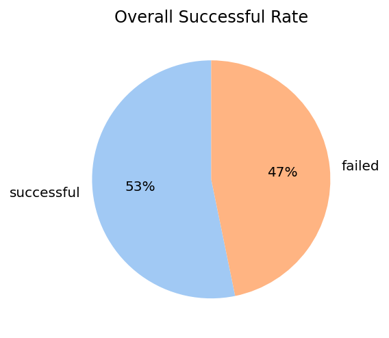
    


* Success ratio is nearly half
* 53% of all projects are success
* While other 47% are not


```python
df = data.copy()
col = 'category'

plt.pie(x=df[col].value_counts(),
        labels=df[col].value_counts().index,
        autopct='%.0f%%',
        colors = sns.color_palette("pastel"),
        startangle=45,
        radius=2,
        labeldistance=1.1,
        rotatelabels=False)
plt.title('Distribution of Projects by Category', pad=120, fontdict={'fontsize':15})
plt.show()
```


    
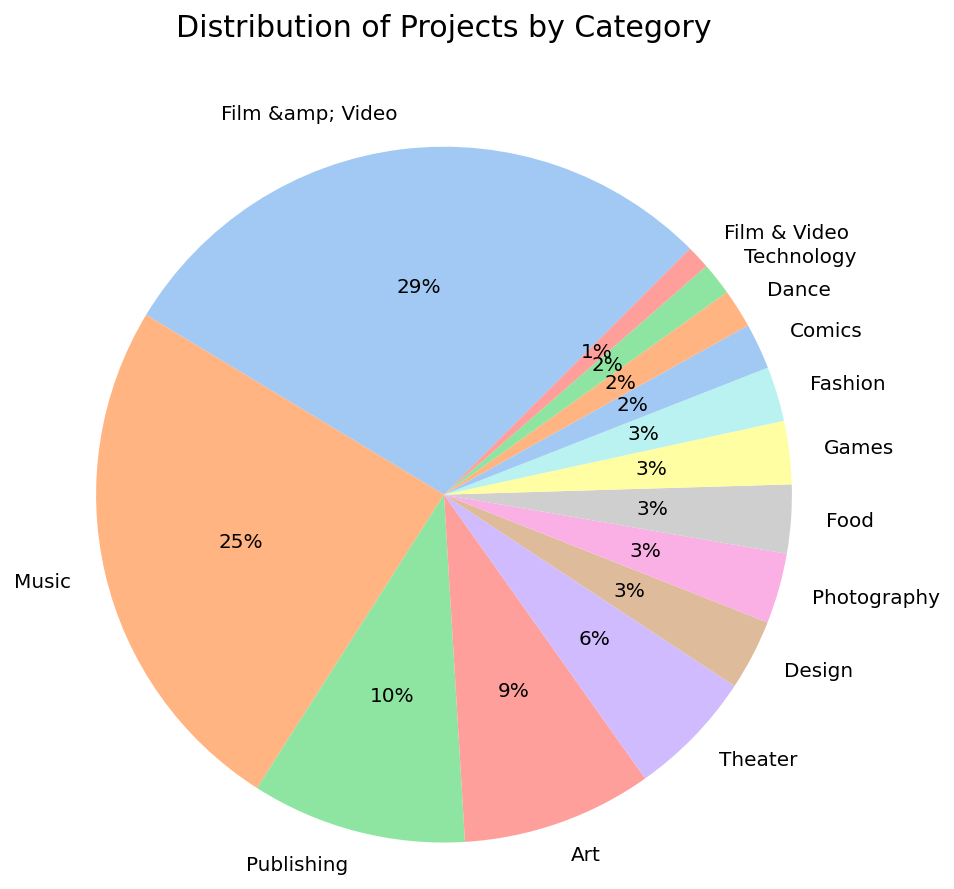
    


* More than half of all campaign are **Film&amp; Video** and **Music**


```python
nrows = 5
ncols = 3
figsize = (15,24)
colors = sns.color_palette("pastel")

df = data.copy()
cat = df['category'].unique()


fig, axs = plt.subplots(nrows=nrows, ncols=ncols, figsize=figsize)


for c, v in enumerate(cat):
    sf = df[df['category']==v]
    sf = sf['subcategory'].value_counts()[sf['subcategory'].value_counts(normalize=True)>0.01]
    axs[c//ncols, c%ncols].pie(x=sf,
            labels=sf.index,
            autopct='%.0f%%',
            colors = sns.color_palette("pastel"),
            startangle=90,
            labeldistance=1.1,
            rotatelabels=False)
    axs[c//ncols, c%ncols].set_title(v)
    
fig.delaxes(axs[4,2])
fig.suptitle('Distribution of Projects by Subcategory', fontsize=15, y=.93)
#plt.subplot_tool()
plt.subplots_adjust(wspace=0.6)
```


    
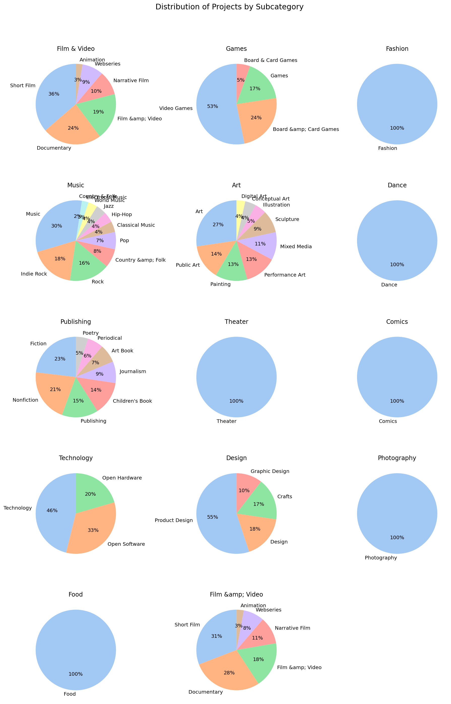
    


```python
state = data['state'].value_counts()[data['state'].value_counts(normalize=True) > 0.01]
plt.pie(x=state,
            labels=state.index,
            autopct='%.0f%%',
            colors = sns.color_palette("pastel"),
            startangle=90,
            labeldistance=1.1,
            rotatelabels=False,
            radius=2)
plt.title('Distribution of Projects by State', pad=110, fontdict={'fontsize':15})
plt.show()

```


    
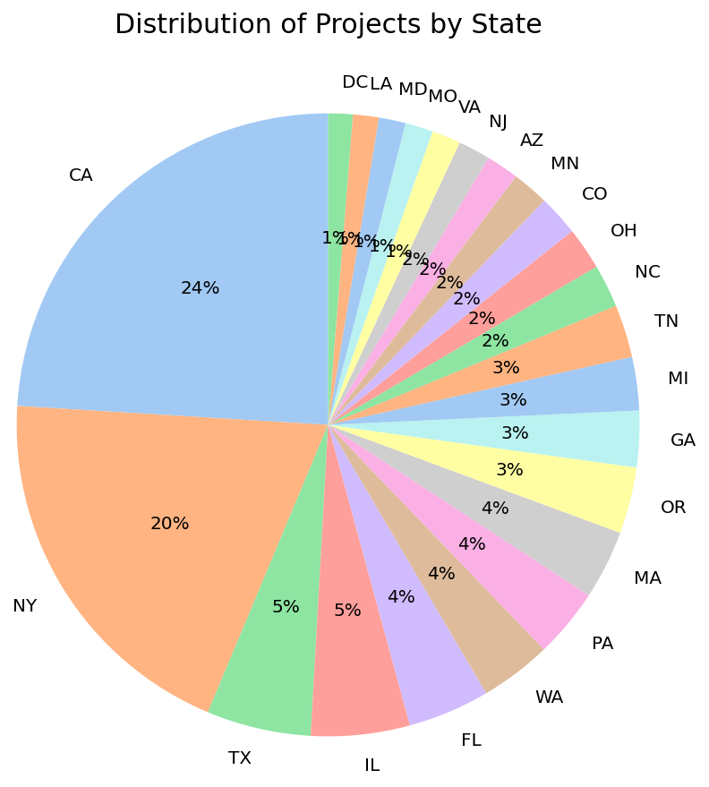
    


* Majority of campaign are happen in **California(CA)** and **New york(NY)**


```python
fig, ax = plt.subplots(figsize=(20,10))
sns.countplot(x='category', hue='status', data=data, palette='coolwarm')
ax.tick_params(labelsize=13)
ax.set_xlabel('Category',fontsize=15)
ax.set_title('Successful Rate by Category', fontsize=18)
plt.legend(fontsize=15)
```


    <matplotlib.legend.Legend at 0x22cf2769e80>


    
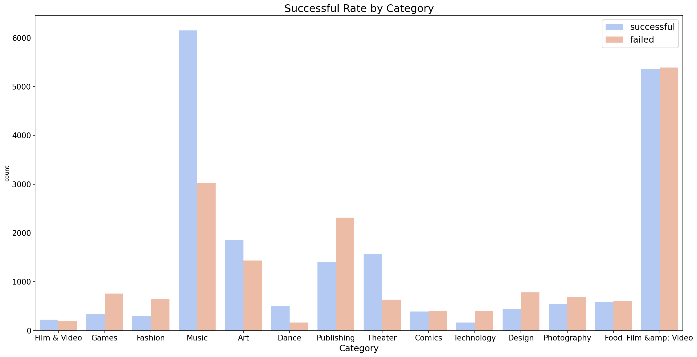
    


* Successful categorys are **Music, Art, Dance, Theater**
* 50/50 percent chance projects category are **Comics, Food, Film&amp Video**
* Failed categories are Games, **Fashion, Publishing, Technolygy, Design, Photography**


```python
nrows = 5
ncols = 3

df = data.copy()
cat = df['category'].unique()


fig, axs = plt.subplots(nrows=nrows, ncols=ncols, figsize=(15,30))

for c, v in enumerate(cat):
    df = data.copy()
    df = df[df['category']==v].astype('str') # if X-ais dtype=category a countplot will show all sub-catagory in dataset 
                                             # (include the subcategory of other main-category)
    sns.countplot(x='subcategory',
                  hue='status',
                  data=df.sort_values(by='status', ascending=False),
                  ax=axs[c//ncols, c%ncols],
                  palette='coolwarm')
    
    plt.setp(axs[c//ncols, c%ncols].xaxis.get_majorticklabels(), rotation=85)
    axs[c//ncols, c%ncols].set_title(v)
    axs[c//ncols, c%ncols].set_xlabel('')

fig.delaxes(axs[4,2]) #remove unuse axs
fig.suptitle('Distribution of Status by Sub-Category', fontsize=15, y=.93)
plt.subplots_adjust(hspace=0.8)
#plt.subplot_tool()
```


    
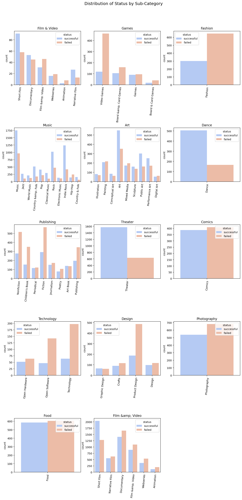
    


* **Sub-categories** success rate are thrend following their **main-categories**.


```python
plt.subplots(figsize=(15,5))
sns.histplot(data=data, x='goal', log_scale=True, hue='status', multiple='layer')
plt.title('Distribution of Fund Goal by Status', loc='center')
plt.show()
```


    
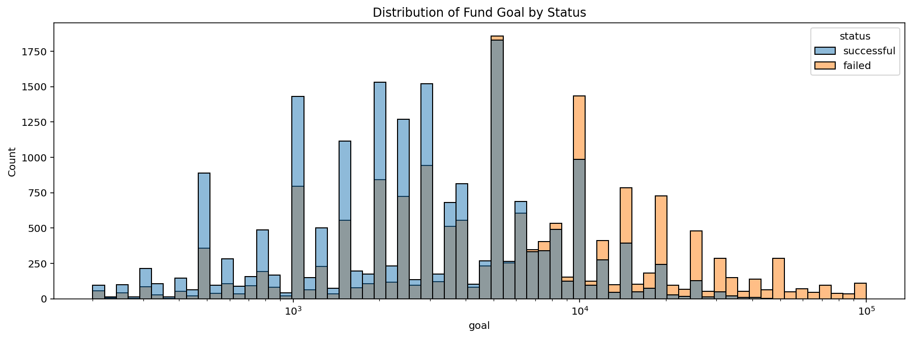
    


* A considering plot showed a **higher cmoney require** is **higher chance to failure**.


```python
fig ,ax = plt.subplots(figsize=(15,5))
df = data.copy()
df['pledged_log'] = np.log10(df['pledged'])
df['pledged_log'].replace([np.inf, -np.inf], 0, inplace=True) # since log10(0) = -inf. so we have to replace it with 0
sns.histplot(data=df, x='pledged_log', log_scale=False, hue='status', multiple='layer')
ax.set_xticklabels([0,0,10,100,1000,10000])
ax.set_xlabel('pledged')
ax.set_title('Distribution of Pledged by Status')
```

    C:\Users\acer\anaconda3\lib\site-packages\pandas\core\arraylike.py:358: RuntimeWarning: divide by zero encountered in log10
      result = getattr(ufunc, method)(*inputs, **kwargs)
    <ipython-input-24-129afff3c3f2>:6: UserWarning: FixedFormatter should only be used together with FixedLocator
      ax.set_xticklabels([0,0,10,100,1000,10000])
    


    Text(0.5, 1.0, 'Distribution of Pledged by Status')


    
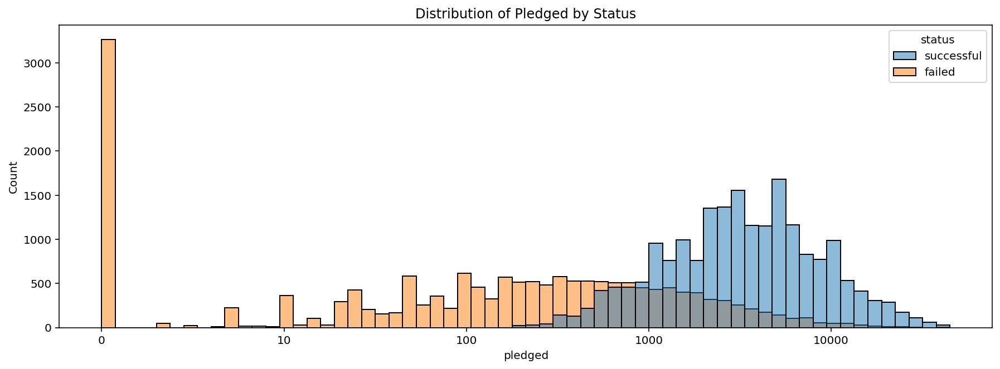
    


```python
cols = ['backers', 'levels', 'updates', 'comments', 'duration']
fig, axs = plt.subplots(nrows=5, ncols=1, figsize=(15,30))


for c, v in enumerate(cols):
    if v == 'backers':
        sns.histplot(data=data, x=v, hue='status',ax=axs[c], multiple='layer', kde=False, discrete=False, binwidth=5)
    else:
        sns.histplot(data=data, x=v, hue='status',ax=axs[c], multiple='layer', kde=False, discrete=True)
    axs[c].set_title(f"Distribution of {v.capitalize()} by Status")
axs[0].set_yscale('log')
axs[2].set_yscale('log')
axs[3].set_yscale('log')
axs[4].set_yscale('log')
plt.subplots_adjust(hspace=.5)
```


    
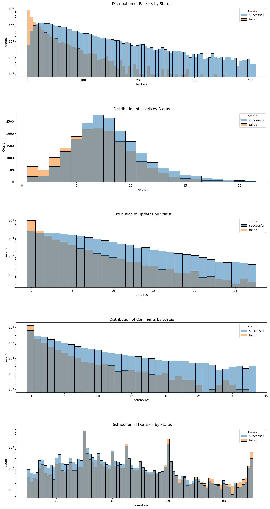
    


Above distribution plots tell us:
* **Higher backers** is higher to success funding.
* The project that give **more 5 option of rewards levels** have high chance to achieve their goal.
* Campaign that have **frequency interact like comment and update** more chance for get their pledged


```python
cols = ['year', 'month', 'day']
fig, axs = plt.subplots(nrows=3, ncols=1, figsize=(8,15))

for c, v in enumerate(cols):
    bins = len(data[v].unique())
    sns.countplot(data=data, x=v, hue='status',ax=axs[c], palette='Set2', )
    axs[c].set_title(f"Distribution of {v.capitalize()} by Status")
plt.subplots_adjust(hspace=.4)
```


    
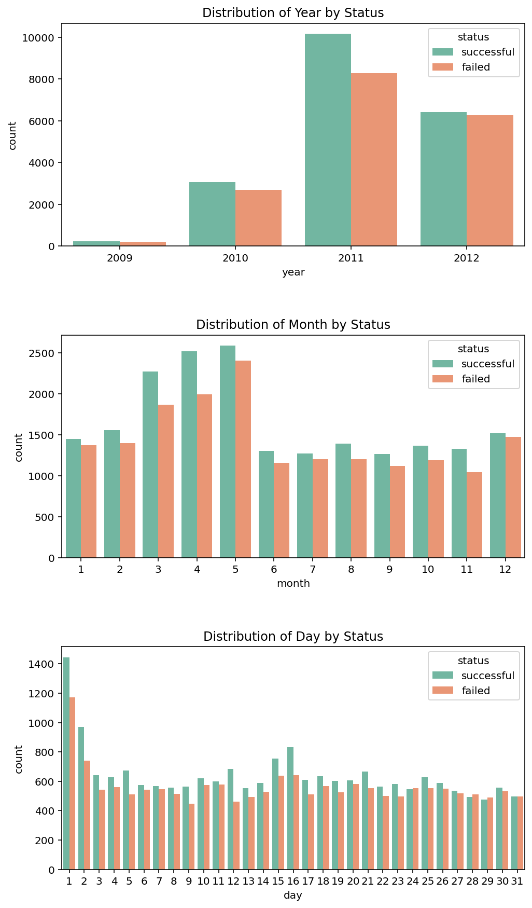
    


```python
plt.subplots(figsize=(15,8))
sns.histplot(data=data, x='date', hue='status', kde=True, multiple='dodge', palette='Set2')
plt.title('Distribution of Date by Status')
plt.show()
```


    
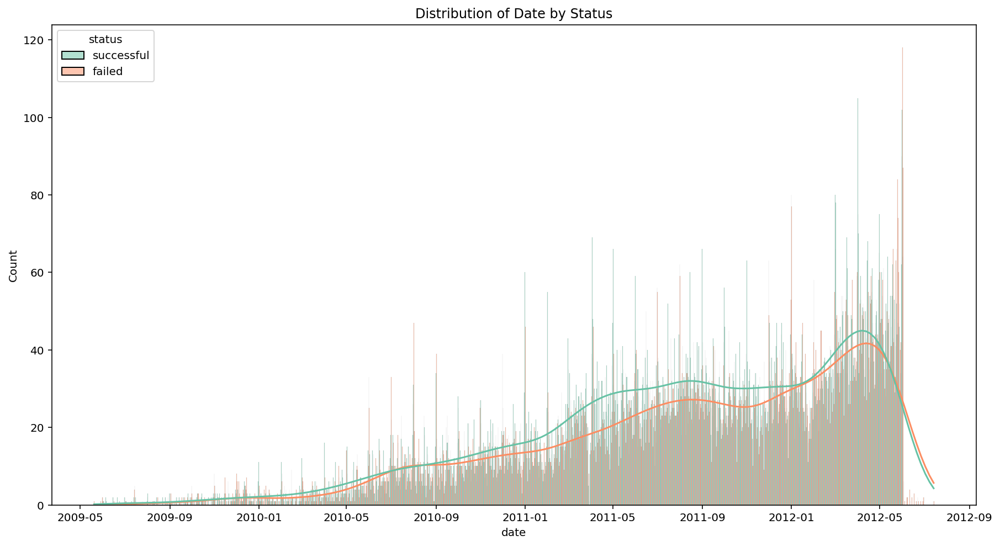
    


* There are no correlation between **time** and **success rate.**


```python
cols = ['goal', 'pledged', 'backers', 'levels', 'updates', 'comments', 'duration']


fig, axs = plt.subplots(nrows=3, ncols=3, figsize=(15,10))

for c, v in enumerate(cols):
        sns.boxplot(x='status', y=v, data=data, width=0.5, orient='v', ax= axs[c//ncols, c%ncols],  palette='seismic')
        axs[c//ncols, c%ncols].set_title(v)
        plt.setp(axs[c//ncols, c%ncols].xaxis.get_majorticklabels(), rotation=0)
        axs[c//ncols, c%ncols].set(xlabel=None, ylabel=None)

axs[0,0].set_yscale('log')
axs[0,1].set_yscale('log') 
        
fig.suptitle('Boxplot distribution by Status', fontsize=15)
fig.delaxes(axs[2,1])        
fig.delaxes(axs[2,2])
plt.subplots_adjust(hspace=0.5)
#plt.subplot_tool()
```


    
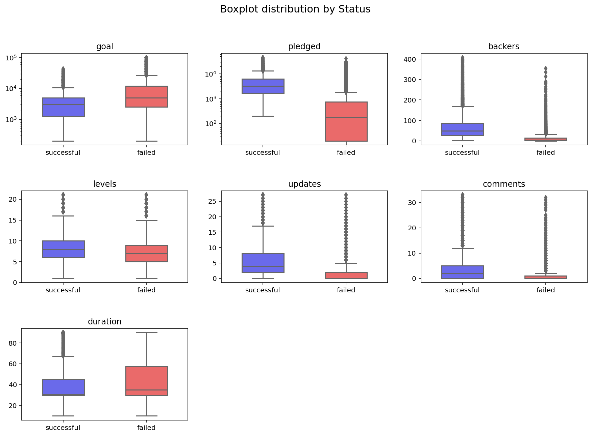
    


```python
cols = ['goal', 'pledged', 'backers', 'levels', 'updates', 'comments', 'duration']

fig, axs = plt.subplots(nrows=3, ncols=3, figsize=(15,10))

for c, v in enumerate(cols):
        sns.violinplot(x='status', y=v, data=data, width=0.8, orient='v', ax= axs[c//ncols, c%ncols],  palette='seismic')
        axs[c//ncols, c%ncols].set_title(v)
        plt.setp(axs[c//ncols, c%ncols].xaxis.get_majorticklabels(), rotation=0)
        axs[c//ncols, c%ncols].set(xlabel=None, ylabel=None)

axs[0,0].set_yscale('log')
axs[0,1].set_yscale('log')

fig.suptitle('Violinplot distribution by Status', fontsize=15)
fig.delaxes(axs[2,1])        
fig.delaxes(axs[2,2])
plt.subplots_adjust(hspace=0.5)
#plt.subplot_tool()
```


    
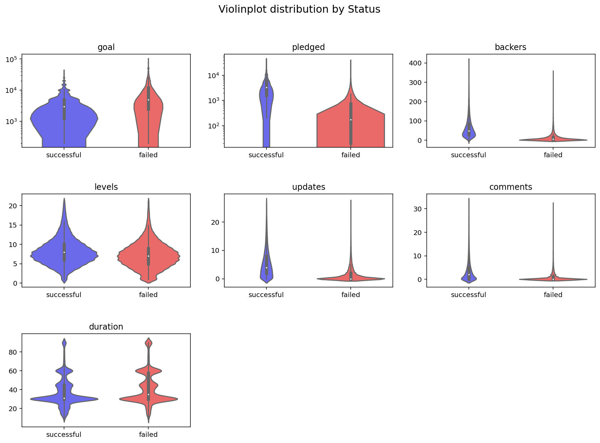
    


```python
fig, ax = plt.subplots(figsize=(15,5))
data['goal_log'] = np.log10(data['goal'])
sns.boxplot(x='category', y='goal', hue='status', data=data, width=0.5, palette='seismic')
ax.set_yscale('log')
ax.legend().remove()

fig.suptitle('Boxplot distribution of Goal by Category', fontsize=15)
fig.legend(loc='right')
plt.setp(ax.xaxis.get_majorticklabels(), rotation=45)
plt.show()
```

    <ipython-input-30-a16595c055ed>:2: SettingWithCopyWarning: 
    A value is trying to be set on a copy of a slice from a DataFrame.
    Try using .loc[row_indexer,col_indexer] = value instead
    
    See the caveats in the documentation: https://pandas.pydata.org/pandas-docs/stable/user_guide/indexing.html#returning-a-view-versus-a-copy
      data['goal_log'] = np.log10(data['goal'])
    


    
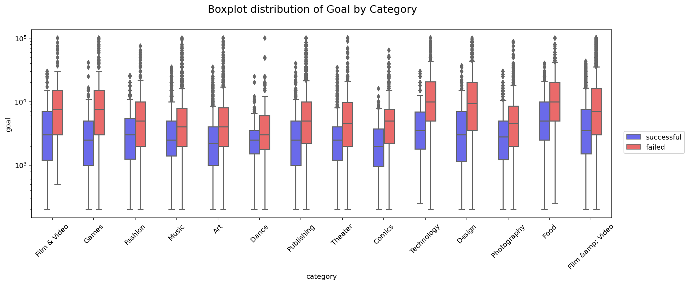
    


```python
fig, ax = plt.subplots(figsize=(15,5))
sns.boxplot(x='category', y='pledged', hue='status', data=data, width=0.5, palette='seismic')
ax.set_yscale('log')
ax.legend().remove()

fig.suptitle('Boxplot distribution of Pledged by Category', fontsize=15)
fig.legend(loc='right')
plt.setp(ax.xaxis.get_majorticklabels(), rotation=45)
plt.show()
```


    
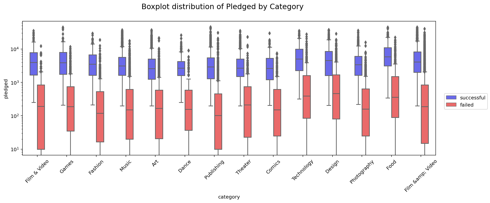
    


```python
fig, ax = plt.subplots(figsize=(15,5))
sns.boxplot(x='category', y='backers', hue='status', data=data, width=0.5, palette='seismic')
ax.set_yscale('log')
ax.legend().remove()

fig.suptitle('Boxplot distribution of backers by Category', fontsize=15)
fig.legend(loc='right')
plt.setp(ax.xaxis.get_majorticklabels(), rotation=45)
plt.show()
```


    
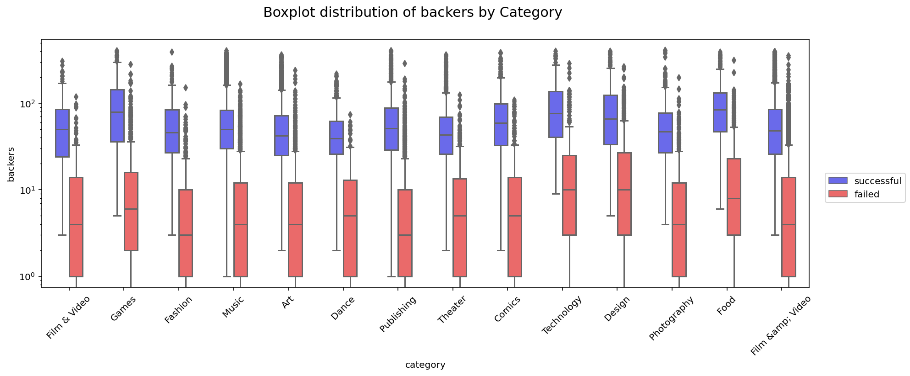
    


```python
fig, ax = plt.subplots(figsize=(15,5))
sns.boxplot(x='category', y='comments', hue='status', data=data, width=0.5, palette='seismic')
ax.set_yscale('linear')
ax.legend().remove()

fig.suptitle('Boxplot distribution of Comments by Category', fontsize=15)
fig.legend(loc='right')
plt.setp(ax.xaxis.get_majorticklabels(), rotation=45)
plt.show()
```


    
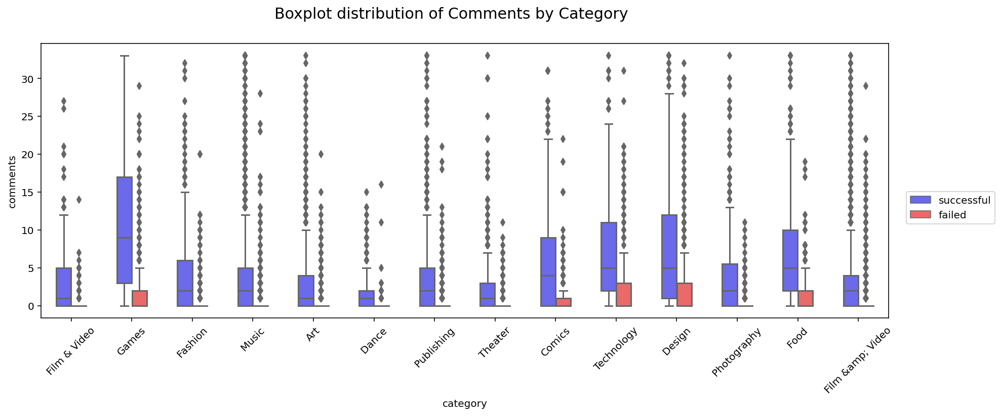
    


```python
fig, ax = plt.subplots(figsize=(15,5))
sns.boxplot(x='category', y='updates', hue='status', data=data, width=0.5, palette='seismic')
ax.set_yscale('linear')
ax.legend().remove()

fig.suptitle('Boxplot distribution of Updates by Category', fontsize=15)
fig.legend(loc='right')
plt.setp(ax.xaxis.get_majorticklabels(), rotation=45)
plt.show()
```


    
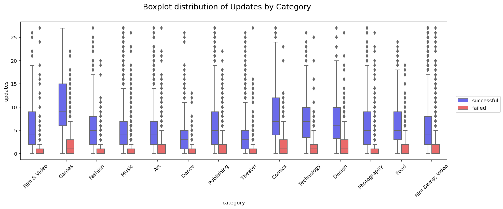
    


* Updates campaign are good way that owner can do to gain a success rate.

## Summary
* Overall success ratio is nearly half
* 53% of all projects are success, while other 47% are not
* More than half of all campaign are **Film&amp; Video** and **Music**
* Majority of campaign are happen in **California(CA)** and **New york(NY)**
* Successful categorys are **Music, Art, Dance, Theater**
* Average success projects category are **Comics, Food, Film&amp Video**
* Failed categories are Games, **Fashion, Publishing, Technolygy, Design, Photography**
* **Sub-categories** success rate are thrend following their **main-categories**.
* A considering plot showed a **higher money require** is higher chance to failure.
* **Higher backers** is higher to success funding.
* The project that give **more 5 option of rewards levels** have high chance to achieve their goal.
* Campaign that have **frequency interact like comment and update** more chance for get their pledged
* There are no correlation between **time** and **success rate.**
* **Updates** campaign are good way that owner can do to gain a success rate.
